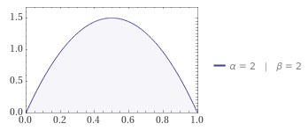

# Beta-distribution

```
"beta_dist_params": {
    "low": [1.2,1.8],
    "mid": [2,2],
    "high": [1.8,1.2],
    "flat": [1,1]
}
```

* A "skewed right" distribution is one in which the tail is on the right side. 
* A "skewed left" distribution is one in which the tail is on the left side

## Low


## Mid


## High


## Flat


